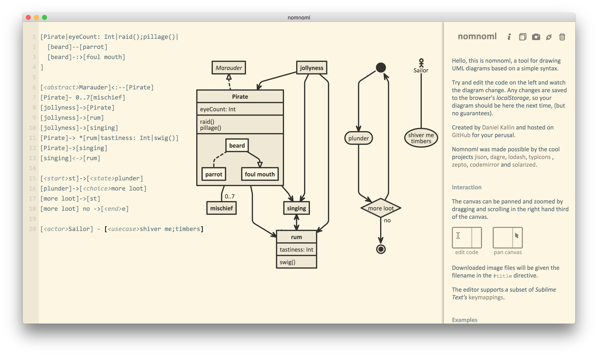
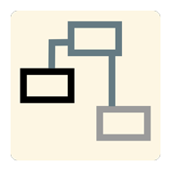

# Nomnoml for Mac

>This is a hybrid project which use [Electron](https://github.com/atom/electron) pack the JavaScript project [Nomnoml](https://github.com/skanaar/nomnoml) to a desktop application on Mac.

## A UML Class Diagram Tool

### Features

- Text-based
- Automatic Graphic Generation
- Automatic Save
- Solarized Light Color Scheme
- Sufficient Document
- Can Export Transparent Snapshot
- Re-designed new icon

### Build
`npm build` : make an application to `output` directory. Then you can start it by `npm start`.

### Installation

You just drag the builded application in `output` directory to your mac application folder.

Enjoy it!
